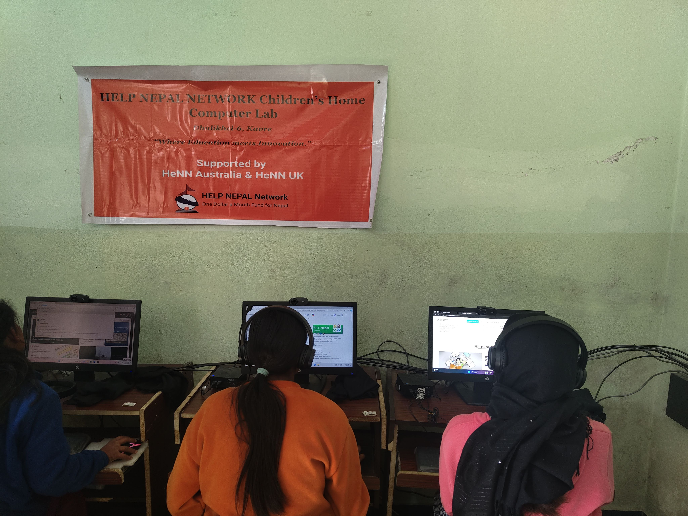

Volunteers from Kathmandu University Open Source Community (KUOSC) in collaboration with Help Nepal Network Nepal (HeNN) conducted a training session for children at Dhulikhel Children's Home. The session focused on equipping the children with essential computer skills and fostering responsible internet usage.

The training aimed to familiarize the children with their newly upgraded computer lab. Volunteers guided them on navigating educational websites like E-Paathsala, E-paath, Maths and Science Quiz, and Hamro Ramailo Kathaharu offered by OLE Nepal. These platforms provide access to a wealth of learning materials, enhancing the children's educational opportunities.

Furthermore, the volunteers emphasized internet safety, educating the children on responsible online behavior and navigating the digital world with caution.

**Volunteers:**
- Aadarsha Dhakal
- Ayush Paudel
- Jamyang Gelek Gurung

**From HeNN Nepal:**
- Merisha Kafle
- Anil Kumar Shrestha

This collaborative effort empowers the children at Dhulikhel Children's Home with valuable technological skills and fosters responsible digital citizenship, paving the way for a brighter future.