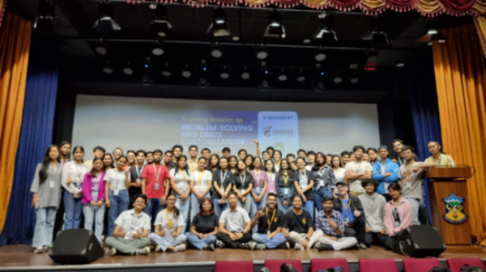

On July 16th, GNOME Nepal, in collaboration with the Kathmandu University Open Source Community (KUOSC), organized an event titled “Problem-Solving and Linux Customization with GNOME” at St. Xavier's College, Maitighar. The event brought together students eager to learn more about Linux and open-source technologies.

The session began with a brief yet insightful introduction to open source, explaining its significance in today’s technology landscape. The speakers emphasized the value of community collaboration in building and improving software, highlighting the real-world impact of open-source projects on innovation and development.

This was followed by an introduction to Linux and its file systems, providing attendees with a foundational understanding of how the operating system works under the hood. The presenters then moved on to a live demonstration of the GNOME desktop environment on Linux, showcasing how easily GNOME can be customized to fit different user preferences. From tweaking the appearance to enhancing system workflows, attendees were shown practical steps to make Linux more personal and efficient.

One of the highlights of the event was the interactive discussion session, where participants engaged in open conversations to better understand the concept of open source. The event concluded with a sense of excitement and curiosity. Participants left with a stronger grasp of Linux customization, the power of GNOME, and the broader open-source movement. For many, it was an eye-opening experience that encouraged further exploration into how open-source technologies can be integrated into their daily lives.

In partnership with KUOSC, GNOME Nepal successfully created a platform for learning and collaboration, underscoring the importance of community-driven technology. The event provided a valuable opportunity for attendees to enhance their technical skills while also cultivating a deeper appreciation for open-source.

