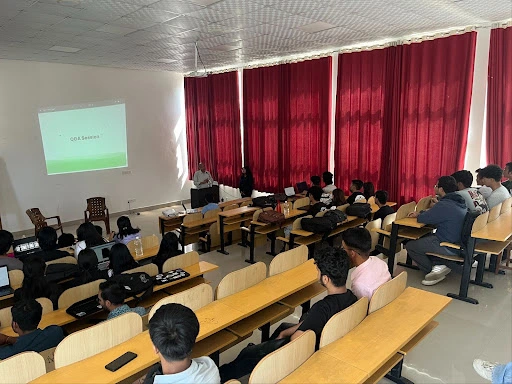

**Bahmni** is an intuitive, open-source Electronic Medical Record (EMR) and hospital management system specifically designed for use in remote areas. Its adoption in various health posts and hospitals across rural Nepal has already significantly improved healthcare delivery. However, during a recent community visit, we identified a critical issue: the **language barrier**. Due to this, a dedicated IT officer had to be stationed solely to operate Bahmni, which hindered the efficient use of the system by local health workers.

To address this issue, the **Kathmandu University Open Source Community (KUOSC)**, in collaboration with the **Health Informatics community of Kathmandu University Computer Club (KUCC)**, initiated a **localization sprint** for Bahmni. Our goal was to translate the interface into **Nepali**, empowering healthcare professionals to directly and more effectively use the software.

### **Day 1: Introduction to Software Localization**

The Kathmandu University Open Source Community, together with the KUCC Health Informatics community, kicked off the localization sprint on **May 16th, 2024**, with an event titled **"Introduction to Software Localization."** This session was attended by approximately **50 participants**, and it underscored the significance of software localization in improving healthcare access.

The event began with an introduction by **Ashwini Subedi**, the event lead. This was followed by insightful talks from **Dr. Bal Krishna Bal**, an expert in Natural Language Processing (NLP), and **Mr. Saroj Dhakal**, a seasoned localization professional. The speakers highlighted the best practices in localization, the role of machine translation, and the impact of localization on language preservation. Mr. Dhakal then conducted a **hands-on session** that provided practical training on localizing Bahmni.

This session was pivotal in raising awareness about localization and setting the stage for our week-long sprint. Attendees gained both theoretical and practical insights, leaving them equipped and motivated to contribute to this meaningful project.

### **Day 2: Exploring Bahmni**

On **June 1st 2024**, we organized a virtual session titled **“Exploring Bahmni”** with **Dr. Akhil Malhotra** and **Mr. Sanjay Paudel** from **NepalEHR**. NepalEHR integrates hospital-based (Bahmni), community-based (Commcare), and data visualization (DHIS2) tools to meet Nepal’s healthcare system needs. 

During the session, our guests shared invaluable insights into the origins of Bahmni, its current applications, and future plans. They also emphasized how localizing the software would make it more accessible for the **primarily Nepali-speaking demographic**, especially in rural regions where healthcare services are most needed.

This deep dive into Bahmni gave us a clearer understanding of the software we were working to localize, reinforcing the importance of our efforts to make healthcare more accessible and efficient.

### **Localization and Review Sessions**

Throughout the week, volunteers diligently contributed their translations, making steady progress. Every weekend, we conducted review sessions via **Google Meet** with **Mr. Saroj Dhakal**, our mentor and reviewer, to refine and review the translated strings. His expertise was crucial in ensuring the accuracy and consistency of the translations.

### **Contribution Leaderboard**

Here are the top contributors to the Bahmni Localization Sprint:

| **Name**           | **Strings Translated** |
|--------------------|------------------------|
| **Safal Narsingh**  | 804                    |
| **Kiran Dahal**     | 613                    |
| **Nirjal Bhurtel**  | 196                    |
| **Lawan Poudel**    | 195                    |
| **Manjul Tamrakar** | 115                    |
| **Anish Timalsina** | 110                    |

Their dedication has been pivotal in bringing Bahmni closer to becoming a fully localized healthcare tool for Nepal.

### **Conclusion**

The **Bahmni Localization Sprint** marks an important step in enhancing healthcare accessibility in rural Nepal. By localizing Bahmni into Nepali, we are enabling local healthcare workers to use this powerful tool without facing language barriers, thus improving efficiency and care delivery.

We are deeply thankful to the **Bahmni Coalition** for permitting us to undertake this project, the **NEEM Project** for their generous support, and all our collaborators for their continued guidance. Together, we are making a lasting impact on healthcare in underserved regions of Nepal, and we look forward to continuing our efforts in the open-source community.

